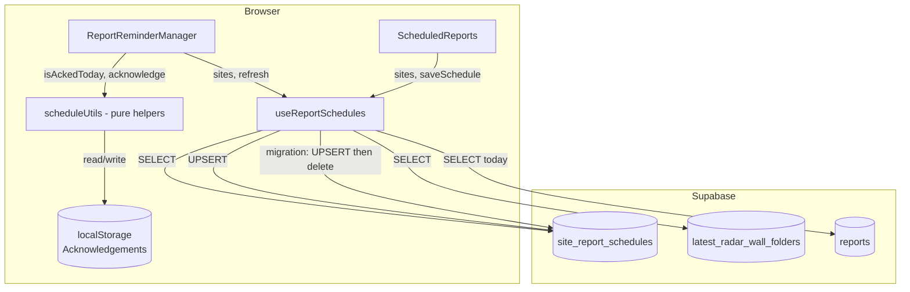

# Design Document — Scalable Report Reminder Scheduler

## Overview

The Scalable Report Reminder Scheduler migrates the existing single-site, localStorage-based report reminder system to a multi-site, Supabase-backed architecture. The core data flow stays the same: the admin dashboard polls Supabase for live sensor data and today's reports, merges them with per-site schedule configuration, and fires a blocking popup reminder when a site's reminder time has passed and its report is still missing.

The key changes are:

1. **Schedule persistence** moves from `localStorage` → `site_report_schedules` (new Supabase table).
2. **Sensor discovery** becomes type-agnostic — all rows in `latest_radar_wall_folders` (excluding `Archive`) are treated as sensors, not just radar.
3. **`scheduleUtils.ts`** is trimmed to keep only pure time helpers and acknowledgement helpers; all localStorage schedule CRUD is removed.
4. **`useReportSchedules.ts`** is rewritten to fetch schedules from Supabase and upsert on save.
5. **`ScheduledReports.tsx`** gains per-row save/error state.
6. **`ReportReminderManager.tsx`** is unchanged in logic — it continues to depend on `useReportSchedules` and `scheduleUtils`.
7. A **one-time migration** runs on hook init: if the old `reportSchedules` localStorage key exists, its entries are upserted to Supabase then the key is deleted.

Acknowledgements remain in `localStorage` (keyed by `siteId + localDate`) because they are intentionally client-local and per-day.

---

## Architecture



**Data flow on load:**

1. `useReportSchedules` fetches `latest_radar_wall_folders` (sensors) and `reports` (today's uploads) and `site_report_schedules` (schedules) in parallel.
2. Sensors are grouped by `site_id`, deduplicated.
3. Each site is merged with its schedule row (or the default schedule if absent).
4. Sites are sorted alphabetically.
5. `SiteReportStatus[]` is returned to both `ReportReminderManager` and `ScheduledReports`.

**Data flow on save:**

1. `ScheduledReports` calls `saveSchedule(siteId, patch)`.
2. Hook applies an optimistic local update immediately.
3. Hook upserts to `site_report_schedules` in the background.
4. On failure: reverts optimistic state, surfaces an error on the affected row.

---

## Components and Interfaces

### `scheduleUtils.ts` — Pure Helpers Only

After refactoring, this file retains only functions that have no Supabase dependency:

```typescript
// TIME HELPERS (unchanged)
export function timeToMinutes(time: string | null | undefined): number | null
export function minutesToTime(total: number): string
export function defaultReminderFor(deadline: string): string
export function defaultSchedule(): SiteSchedule
export function localDateKey(d?: Date): string

// ACKNOWLEDGEMENT HELPERS (unchanged)
export function loadAcks(): Record<string, string>
export function isAckedToday(siteId: string): boolean
export function acknowledge(siteId: string): void

// REMINDER LOGIC (unchanged)
export function shouldRemind(
  schedule: SiteSchedule,
  generatedToday: boolean,
  acked: boolean,
  now?: Date
): boolean

// REMOVED from this file:
// - loadSchedules()
// - saveSchedule()
// - getSchedule()
// - SCHEDULES_KEY constant
// - SCHEDULES_UPDATED_EVENT constant
```

The `SiteSchedule` interface is unchanged:

```typescript
export interface SiteSchedule {
  deadline: string;   // "HH:MM" 24-hour
  reminder: string;   // "HH:MM" 24-hour
  enabled: boolean;
}
```

### `useReportSchedules.ts` — Supabase-Backed Hook

Public API (unchanged for callers):

```typescript
export function useReportSchedules(): {
  sites: SiteReportStatus[];
  loading: boolean;
  saveSchedule: (siteId: string, patch: Partial<SiteSchedule>) => void;
  refresh: () => void;
}
```

Internal additions:

```typescript
// Per-row async state tracked inside the hook
type RowSaveState = { saving: boolean; error: string | null };

// Exposed on SiteReportStatus (new fields)
export interface SiteReportStatus {
  id: string;
  name: string;
  sensorCount: number;
  sensors: SensorReportStatus[];
  pendingSensors: SensorReportStatus[];
  generatedToday: boolean;
  schedule: SiteSchedule;
  saving: boolean;        // NEW — true while upsert is in flight for this site
  saveError: string | null; // NEW — non-null when the last upsert failed
}
```

`saveSchedule` becomes async internally:

```typescript
const saveSchedule = useCallback((siteId: string, patch: Partial<SiteSchedule>) => {
  // 1. Optimistic update in local state
  setSites(prev => prev.map(s =>
    s.id === siteId
      ? { ...s, schedule: { ...s.schedule, ...patch }, saving: true, saveError: null }
      : s
  ));

  // 2. Capture current schedule for potential rollback
  const current = sites.find(s => s.id === siteId)?.schedule ?? defaultSchedule();
  const updated: SiteSchedule = { ...current, ...patch };

  // 3. Upsert to Supabase
  supabase
    .from('site_report_schedules')
    .upsert({
      site_id: siteId,
      deadline: updated.deadline,
      reminder: updated.reminder,
      enabled: updated.enabled,
      updated_at: new Date().toISOString(),
    })
    .then(({ error }) => {
      if (error) {
        // Rollback optimistic update
        setSites(prev => prev.map(s =>
          s.id === siteId
            ? { ...s, schedule: current, saving: false, saveError: error.message }
            : s
        ));
      } else {
        setSites(prev => prev.map(s =>
          s.id === siteId ? { ...s, saving: false, saveError: null } : s
        ));
      }
    });
}, [sites]);
```

Migration logic (runs once on first load):

```typescript
const migrateFromLocalStorage = useCallback(async (existingSiteIds: Set<string>) => {
  const SCHEDULES_KEY = 'reportSchedules';
  if (typeof window === 'undefined') return;
  const raw = window.localStorage.getItem(SCHEDULES_KEY);
  if (!raw) return;

  let legacy: Record<string, SiteSchedule>;
  try { legacy = JSON.parse(raw); } catch { return; }

  // Only migrate sites not already in Supabase
  const toUpsert = Object.entries(legacy)
    .filter(([siteId]) => !existingSiteIds.has(siteId))
    .map(([site_id, s]) => ({
      site_id,
      deadline: s.deadline,
      reminder: s.reminder,
      enabled: s.enabled,
      updated_at: new Date().toISOString(),
    }));

  if (toUpsert.length === 0) {
    window.localStorage.removeItem(SCHEDULES_KEY);
    return;
  }

  const { error } = await supabase.from('site_report_schedules').upsert(toUpsert);
  if (error) {
    console.error('[ReportScheduler] Migration failed — localStorage data preserved:', error);
    return;
  }
  window.localStorage.removeItem(SCHEDULES_KEY);
}, []);
```

### `ScheduledReports.tsx` — Save State Per Row

The component reads `site.saving` and `site.saveError` from the enriched `SiteReportStatus`:

```tsx
{editing && site.saving && (
  <Loader className="w-4 h-4 animate-spin text-[var(--dtg-gray-400)]" />
)}
{editing && site.saveError && (
  <span className="text-red-400 text-xs max-w-[160px] truncate" title={site.saveError}>
    Save failed
  </span>
)}
```

The rest of the component markup is unchanged. The `saveSchedule` call signature from the hook remains identical so no call-site changes are required.

### `ReportReminderManager.tsx` — No Changes Required

This component calls `useReportSchedules()` and `shouldRemind/isAckedToday/acknowledge` from `scheduleUtils`. None of its logic or markup needs to change because:

- `useReportSchedules` public API is preserved.
- `shouldRemind`, `isAckedToday`, and `acknowledge` remain in `scheduleUtils`.

---

## Data Models

### Supabase Table: `site_report_schedules`

```sql
CREATE TABLE IF NOT EXISTS site_report_schedules (
  site_id     text        PRIMARY KEY,
  deadline    text        NOT NULL DEFAULT '06:00',
  reminder    text        NOT NULL DEFAULT '05:30',
  enabled     boolean     NOT NULL DEFAULT true,
  updated_at  timestamptz NOT NULL DEFAULT now()
);

ALTER TABLE site_report_schedules ENABLE ROW LEVEL SECURITY;

CREATE POLICY "Admins can manage schedules"
  ON site_report_schedules
  FOR ALL
  TO authenticated
  USING (true)
  WITH CHECK (true);
```

**Column notes:**
- `site_id` — matches `site_id` in `latest_radar_wall_folders`; text PK enables natural join without surrogate keys.
- `deadline` / `reminder` — stored as `"HH:MM"` strings (24-hour); format validated on the client before upsert.
- `updated_at` — always set to `now()` on upsert so the admin can audit when a schedule was last changed.
- No `site_name` column (removed from the original requirements draft) — the site name is always sourced from `latest_radar_wall_folders` to avoid duplication.

### Existing Table: `latest_radar_wall_folders`

Used read-only. Relevant columns:

| Column        | Type   | Notes                                              |
|---------------|--------|----------------------------------------------------|
| `radar_number`| text   | Sensor identifier, used in filename matching       |
| `site_id`     | text   | Groups sensors into sites                          |
| `site_name`   | text   | Display name                                       |
| `type`        | text   | Rows with `type = 'Archive'` are excluded          |

### Existing Table: `reports`

Used read-only. Relevant columns:

| Column       | Type        | Notes                                              |
|--------------|-------------|----------------------------------------------------|
| `filename`   | text        | Searched for sensor identifier (case-insensitive)  |
| `client_id`  | text/number | Optionally used to scope report lookup to a site   |
| `created_at` | timestamptz | Filtered to `>= start of today (local)`            |

### TypeScript Interfaces

```typescript
export interface SiteSchedule {
  deadline: string;      // "HH:MM" 24-hour local time
  reminder: string;      // "HH:MM" 24-hour local time
  enabled: boolean;
}

export interface SensorReportStatus {
  radarNumber: string;
  generatedToday: boolean;
}

export interface SiteReportStatus {
  id: string;
  name: string;
  sensorCount: number;
  sensors: SensorReportStatus[];
  pendingSensors: SensorReportStatus[];
  generatedToday: boolean;
  schedule: SiteSchedule;
  saving: boolean;          // true while upsert in flight
  saveError: string | null; // non-null on last failed upsert
}
```

---

## Correctness Properties

*A property is a characteristic or behavior that should hold true across all valid executions of a system — essentially, a formal statement about what the system should do. Properties serve as the bridge between human-readable specifications and machine-verifiable correctness guarantees.*

### Property 1: Default schedule for unknown sites

*For any* site ID not present in the stored schedule rows, the schedule returned by the merge logic shall equal the default schedule (`deadline: "06:00"`, `reminder: "05:30"`, `enabled: true`).

**Validates: Requirements 1.5, 2.4, 8.3**

---

### Property 2: Merge preserves all discovered sites

*For any* list of sensor registry rows (none with `type = 'Archive'`), the set of `site_id` values in the merged result shall equal exactly the set of distinct `site_id` values in the input rows.

**Validates: Requirements 2.1, 2.3, 8.3**

---

### Property 3: Site isolation — saving one site leaves others unchanged

*For any* collection of sites and any target `siteId`, applying `saveSchedule(siteId, patch)` shall leave the `schedule` of every other site exactly unchanged.

**Validates: Requirements 2.2**

---

### Property 4: Archive rows are excluded from sensor discovery

*For any* list of registry rows that includes rows with `type = 'Archive'`, no sensor from an Archive row shall appear in the merged site list.

**Validates: Requirements 8.1**

---

### Property 5: Sensor deduplication within a site

*For any* list of registry rows that contains duplicate `radar_number` values for the same `site_id`, the resulting `sensors` array for that site shall contain each `radar_number` exactly once.

**Validates: Requirements 8.2**

---

### Property 6: Sites are sorted alphabetically by name

*For any* unordered list of sites, the merged result shall be in non-decreasing alphabetical order by `site_name` (locale-aware string comparison).

**Validates: Requirements 8.4**

---

### Property 7: Case-insensitive sensor-to-report matching

*For any* sensor identifier and any report filename, the `isGenerated` function shall return `true` if and only if `filename.toLowerCase().includes(sensorId.toLowerCase())`.

**Validates: Requirements 3.2**

---

### Property 8: generatedToday and pendingSensors are consistent

*For any* site with a non-empty sensor list, `generatedToday === (pendingSensors.length === 0)` shall always hold; every sensor in `pendingSensors` shall have `generatedToday === false`, and every sensor not in `pendingSensors` shall have `generatedToday === true`.

**Validates: Requirements 3.3, 3.4**

---

### Property 9: shouldRemind is true exactly when all conditions are met

*For any* `SiteSchedule`, `generatedToday` flag, `acked` flag, and current time `now`, `shouldRemind(schedule, generatedToday, acked, now)` shall return `true` if and only if `schedule.enabled === true`, `generatedToday === false`, `acked === false`, and `timeToMinutes(now) >= timeToMinutes(schedule.reminder)`.

**Validates: Requirements 5.1**

---

### Property 10: Acknowledge–then–check round trip

*For any* site ID, calling `acknowledge(siteId)` then `isAckedToday(siteId)` shall return `true` (using the same local date).

**Validates: Requirements 5.4, 6.1**

---

### Property 11: Ack expiry — previous-day acknowledgements do not suppress today's reminder

*For any* site ID and any date string `d` that does not equal today's `localDateKey()`, writing `d` as the ack value for that site shall result in `isAckedToday(siteId)` returning `false`.

**Validates: Requirements 5.6, 6.3**

---

### Property 12: defaultReminderFor is always 30 minutes before the deadline

*For any* valid `"HH:MM"` deadline string, `defaultReminderFor(deadline)` shall return the time that is exactly 30 minutes before the deadline, wrapping around midnight correctly.

**Validates: Requirements 4.3**

---

### Property 13: Custom reminder is preserved when deadline changes

*For any* site whose current `reminder` value differs from `defaultReminderFor(site.schedule.deadline)`, calling `saveSchedule(siteId, { deadline: newDeadline })` shall not modify the `reminder` field.

**Validates: Requirements 4.4**

---

### Property 14: timeToMinutes / minutesToTime round trip

*For any* valid `"HH:MM"` time string `t`, `minutesToTime(timeToMinutes(t)!)` shall equal `t` (with zero-padded hours and minutes).

**Validates: Requirements 1.2 (time format contract)**

---

## Error Handling

### Supabase Fetch Errors

- If either the `latest_radar_wall_folders` or `reports` query fails on load, the hook catches the error, logs it to the console, and leaves `sites` as an empty array with `loading: false`. The UI displays "No sites available."
- If only the `site_report_schedules` fetch fails, the hook falls back to applying the default schedule for all sites (matching the same behavior as "no rows found") and logs the error.

### Upsert Failures

- The hook uses an optimistic update pattern. On upsert failure the previous schedule value is restored from the closure-captured snapshot.
- `site.saveError` is set to the Supabase error message. `ScheduledReports` displays "Save failed" on the affected row.
- The error is cleared on the next successful save for that site, or when the row is refreshed.

### Migration Failures

- If the migration upsert rejects, the `reportSchedules` localStorage key is **not** deleted. The error is logged with a descriptive prefix so it is easy to identify in the browser console.
- The rest of the dashboard loads normally — migration failure is non-blocking.

### Invalid Time Strings

- `timeToMinutes()` returns `null` for inputs that do not match `HH:MM` or are out of range.
- `shouldRemind()` treats a `null` reminderMin as "not yet reached" (returns `false`) so a malformed schedule does not trigger false positives.
- `defaultReminderFor()` returns `'05:30'` as a safe fallback when the input is invalid.

---

## Testing Strategy

### Dual Testing Approach

Unit and property-based tests cover the pure logic layer. Integration tests cover the Supabase data flow with a real or emulated database.

### Property-Based Testing

The pure functions in `scheduleUtils.ts` and the merge logic extracted from `useReportSchedules.ts` are well-suited to property-based testing. The recommended library is **[fast-check](https://github.com/dubzzz/fast-check)** (TypeScript-native, integrates with Vitest/Jest, widely maintained).

Each property test shall run a **minimum of 100 iterations** and be tagged with a comment referencing the design property it validates.

Tag format: `// Feature: scalable-report-scheduler, Property N: <property_text>`

**Properties → Test Functions:**

| Design Property | Test Target | fast-check Arbitraries |
|-----------------|-------------|------------------------|
| P1 Default schedule | `getSchedule(map, unknownId)` | `fc.string()` for unknown site IDs |
| P2 Merge completeness | `mergeSites(registryRows, scheduleRows)` | `fc.array(registryRowArb)` |
| P3 Site isolation | `saveSchedule` + state update | `fc.array(siteArb)`, `fc.string()` for target siteId |
| P4 Archive exclusion | `mergeSites` filter | `fc.array(registryRowArb)` incl. Archive rows |
| P5 Deduplication | `mergeSites` | `fc.array(registryRowArb)` with repeated radar_numbers |
| P6 Alphabetical sort | `mergeSites` | `fc.array(siteArb)` with random names |
| P7 Case-insensitive match | `isGenerated(siteId, radarNumber, reports)` | `fc.string()` + `fc.string()` with random casing |
| P8 generatedToday consistency | `mergeSites` output | `fc.array(registryRowArb)` + `fc.array(reportArb)` |
| P9 shouldRemind conditions | `shouldRemind()` | `fc.record({ enabled, deadline, reminder })` + `fc.date()` |
| P10 Ack round trip | `acknowledge()` + `isAckedToday()` | `fc.string()` for site IDs |
| P11 Ack expiry | `isAckedToday()` | `fc.string()` + past date strings |
| P12 defaultReminderFor | `defaultReminderFor()` | `fc.tuple(fc.integer(0,23), fc.integer(0,59))` → formatted time |
| P13 Custom reminder preserved | `saveSchedule` state update | `fc.record({ deadline, reminder })` where reminder ≠ default |
| P14 Time round trip | `timeToMinutes` + `minutesToTime` | `fc.tuple(fc.integer(0,23), fc.integer(0,59))` → "HH:MM" |

### Unit Tests (Example-Based)

Focus on specific scenarios that properties alone do not cover:

- **Migration**: mock localStorage with `reportSchedules`, mock Supabase upsert to succeed → key deleted; mock to fail → key retained, error logged.
- **Loading UI**: render `ScheduledReports` with `loading: true` → spinner shown; `loading: false, sites: []` → "No sites available" shown.
- **Save loading state**: mock a pending upsert, render row in edit mode → `Loader` icon visible on that row.
- **Save error state**: mock a failed upsert → "Save failed" text visible, schedule reverted.
- **Popup renders null**: render `ReportReminderManager` with all sites `generatedToday: true` → returns `null`.
- **Popup blocks UI**: render with `due.length > 0` → backdrop overlay present in DOM.
- **Interval setup**: mock `setInterval`, render `ReportReminderManager` → confirm 30 000 ms and 300 000 ms intervals registered.
- **Manage Schedule toggle**: render `ScheduledReports`, click toggle → editable inputs appear.

### Integration Tests

- Upsert a schedule row to a real/emulated Supabase instance and re-query to confirm round-trip fidelity.
- Fetch `latest_radar_wall_folders` and verify Archive rows are absent in the hook output.
- End-to-end: save a schedule change from `ScheduledReports`, reload the page, confirm the value persists.

### Test File Layout

```
components/admin/Radar/ReportReminder/
  __tests__/
    scheduleUtils.property.test.ts   -- Properties P9–P14 (pure functions)
    mergeLogic.property.test.ts      -- Properties P1–P8 (merge / sensor discovery)
    useReportSchedules.unit.test.ts  -- Migration, save-state, fetch error
    ScheduledReports.unit.test.tsx   -- Loading/error UI, manage toggle
    ReportReminderManager.unit.test.tsx -- Popup render, blocking, interval
```
